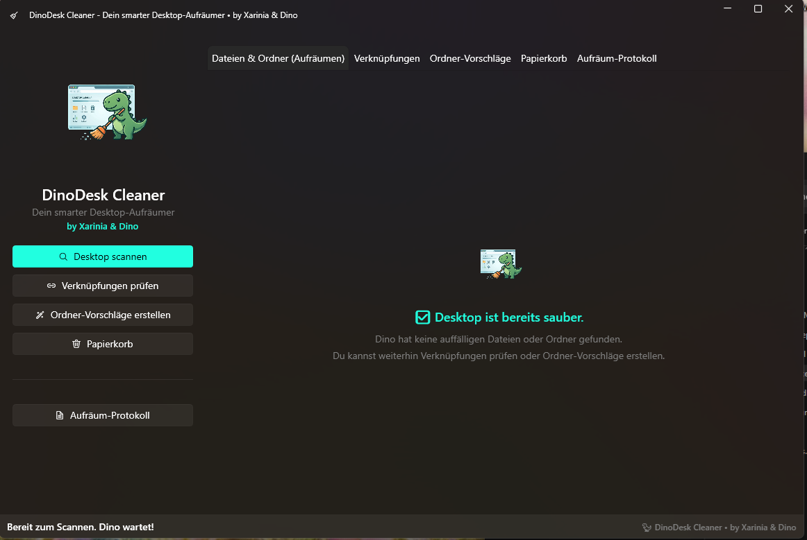
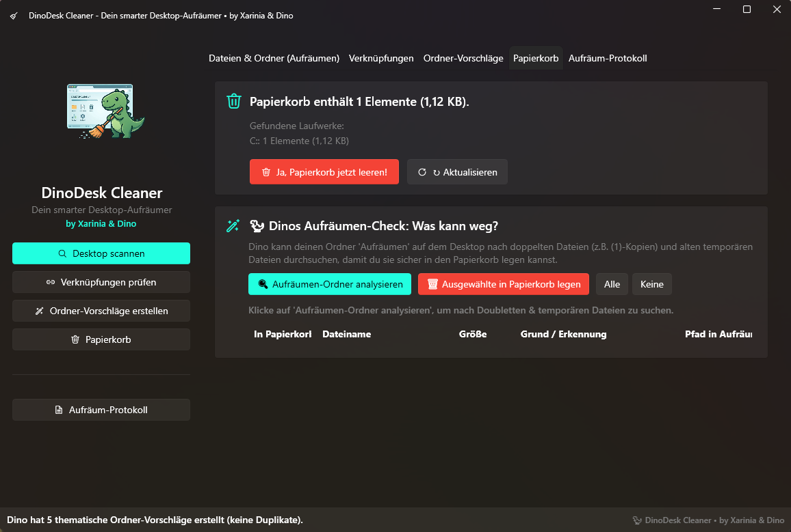

# 🦕 DinoDesk Cleaner
Dein smarter Desktop-Aufräumer

DinoDesk Cleaner ist ein kleines Windows-Tool, das den Desktop aufräumt, Dateien sinnvoll einsortiert, Verknüpfungen überprüft und beim Organisieren hilft – ohne ungefragt persönliche Dateien zu löschen.

## Features

- 🧹 **Desktop-Dateien und Ordner aufräumen**
- 📁 **Ablage unter Aufräumen\Datum\Kategorie**
- 🔗 **Verknüpfungen separat prüfen**
- 🔎 **Ausgewählte Programme direkt in Windows „Installierte Apps“ suchen**
- 🗂 **Ordner-Vorschläge**
- 🗑 **Papierkorb prüfen und leeren**
- ↩ **Zuletzt gelöschtes Element aus dem Papierkorb wiederherstellen**
- ↶ **Letzte Aufräumaktion rückgängig machen**
- 🦕 **Eigener DinoDesk-Aufräumordner mit Dino-Symbol**
- ✅ **Hinweis, wenn der Desktop bereits sauber ist**
- 🔒 **Keine ungefragte Deinstallation oder Löschung**

## Voraussetzungen

- Windows 10 / Windows 11
- .NET 10.0 (in der self-contained Version nicht zwingend separat nötig)

## Verwendung

1. **DinoDesk Cleaner starten**
2. **Desktop scannen**: Klicke auf den Button, um alle Dateien und Ordner auf dem Desktop zu analysieren.
3. **Vorschläge prüfen**: Markiere die gewünschten Dateien in der Liste.
4. **Gewünschte Aktionen auswählen**: Klicke auf "Auswahl jetzt aufräumen".
5. **Dino räumt auf**: Die Dateien werden in den Ordner "Aufräumen" sortiert.

## Sicherheit

Alle kritischen Aktionen (wie das endgültige Löschen im Papierkorb oder das Verschieben von Verknüpfungen) müssen immer manuell bestätigt werden. DinoDesk löscht nichts automatisch und deinstalliert keine Programme ohne deine ausdrückliche Zustimmung.

## Download

Die fertige Windows-Version (ZIP-Datei) befindet sich unter [GitHub Releases](../../releases). Einfach herunterladen, entpacken und die `DinoDeskCleaner.exe` starten.
